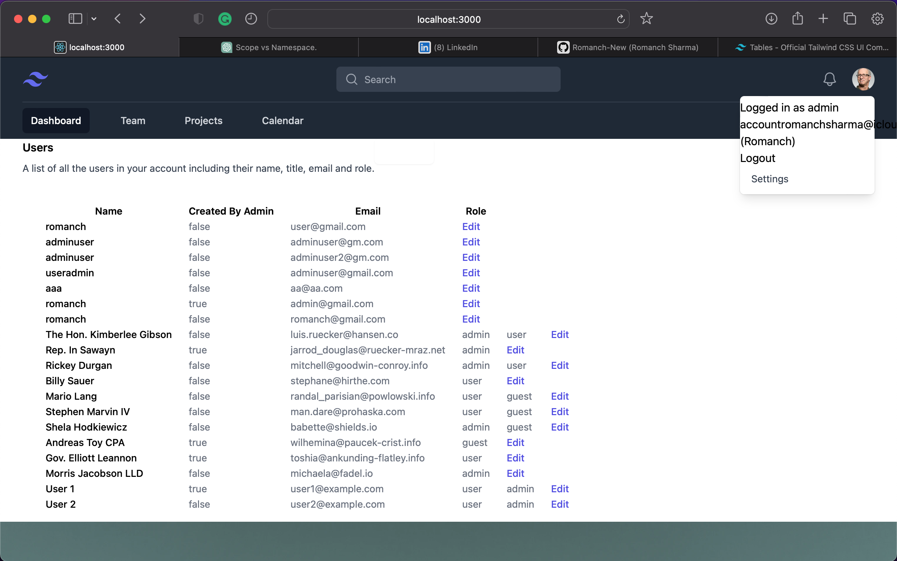

# Gym Management System

## Overview

This is a web-based gym management system developed using Ruby on Rails. It helps gym owners manage their facilities, memberships, and clients.


## Features

* User authentication
* Dashboard for gym owners to manage facilities and memberships
* Dashboard for clients to manage their own profiles and memberships
* Billing and payment management
* Integration with third-party services such as Stripe for payments
## Installation

Clone the repository to your local machine
bash
1. Clone the repository
```Copy code 
git clone https://github.com/your-username/gym-management-system.git 
```
2. Install the required gems
```Copy code
bundle install
```
3. Setup the database
```Copy code
rails db:migrate
```
4. Start the server
```Copy code
rails server
```
## Usage

1. Go to http://localhost:3000 in your web browser
2. Log in as a gym owner or client to access the appropriate dashboard
## Contributing

Contributions are welcome. Please open an issue or a pull request if you have any suggestions or improvements.

## License

This project is licensed under the [__MIT License__]().


